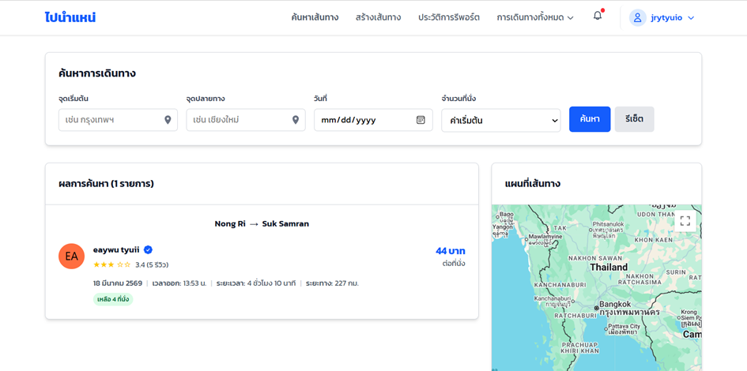
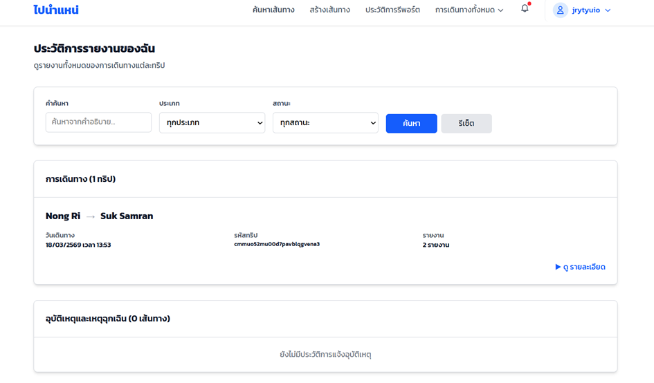
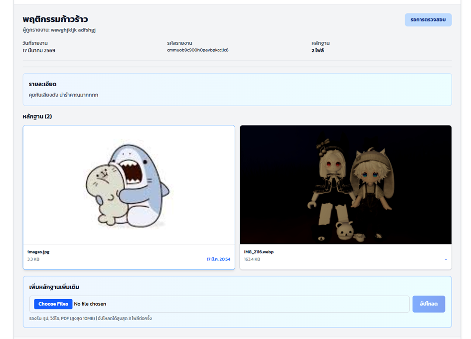
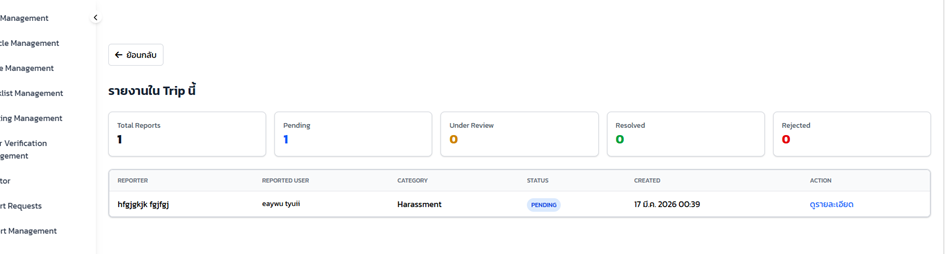
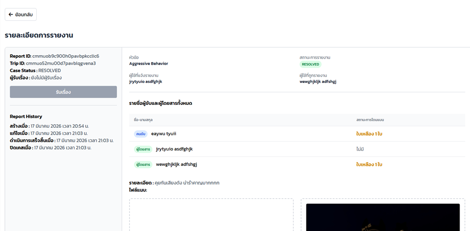

# เอกสารคู่มือการใช้งาน
## "ไปนำแหน่" เว็บแอปพลิเคชันการเดินทางร่วมกันอย่างปลอดภัย
### "Pai Nam Nae" A Safe Ride Sharing: Web Application

---

## รายวิชา
CP353004 Software Engineering  
ภาคเรียนที่ 2 ปีการศึกษา 2568  
สาขาวิชาวิทยาการคอมพิวเตอร์ คณะวิทยาศาสตร์  
มหาวิทยาลัยขอนแก่น

---

## จัดทำโดย

| รหัสนักศึกษา | ชื่อ - สกุล |
|---|---|
| 663380012-6 | นายณัฐพัฒน์ แสนตรี |
| 663380021-5 | นายยศนนท์ ดวงไข |
| 663380212-8 | นายธนวัฒน์ เอื้อศิริประชา |
| 663380216-0 | นายปกรณ์ จำนงค์นารถ |
| 663380234-8 | นายวิสิษฏ์ ศรีอดิศักดิ์ |
| 663380503-7 | นางสาวกัญญาพัชร ฉายผาด |
| 663380509-5 | นางสาวพิมอัปสร แพน |

---

## คำนำ

เอกสารฉบับนี้จัดทำขึ้นเพื่ออธิบายขั้นตอนการใช้งานระบบ “ไปนำแหน่” สำหรับผู้ใช้งานทั่วไปและผู้ดูแลระบบ (Admin) โดยครอบคลุมการใช้งานฟังก์ชันหลักของระบบ ได้แก่ การรายงานปัญหา (Report) การติดตามและจัดการรายงานของผู้ดูแลระบบ (Monitor) รวมถึงฟังก์ชันการให้คะแนนและรีวิวผู้ขับขี่ (Driver Review)

ระบบถูกพัฒนาขึ้นเพื่อเพิ่มความปลอดภัย ความโปร่งใส และความน่าเชื่อถือในการใช้งานแพลตฟอร์ม โดยเปิดโอกาสให้ผู้ใช้งานสามารถแจ้งปัญหาที่เกิดขึ้นระหว่างการเดินทางได้อย่างสะดวก พร้อมทั้งให้ผู้ดูแลระบบสามารถตรวจสอบ ติดตาม และจัดการเหตุการณ์ต่าง ๆ ได้อย่างมีประสิทธิภาพ

คณะผู้จัดทำ

---

## สารบัญ

- [ส่วนที่ 1 การพัฒนาข้อกำหนดนโยบายในการสมัคร](#ส่วนที่-1-การพัฒนาข้อกำหนดนโยบายในการสมัคร)
- [ส่วนที่ 2 การขอข้อมูลประวัติการใช้งาน](#ส่วนที่-2-การขอข้อมูลประวัติการใช้งาน)
- [ส่วนที่ 3 การรายงานปัญหาการเดินทาง](#ส่วนที่-3-การรายงานปัญหาการเดินทาง)
- [ส่วนที่ 4 การให้คะแนนดาวและรีวิวผู้ขับขี่](#ส่วนที่-4-การให้คะแนนดาวและรีวิวผู้ขับขี่)
- [ส่วนที่ 5 การตรวจสอบ Log (Monitor Dashboard)](#ส่วนที่-5-การตรวจสอบ-log-monitor-dashboard)

---

## ส่วนที่ 1 การพัฒนาข้อกำหนดนโยบายในการสมัคร

### การเข้าสู่ระบบและสมัครสมาชิก

การเข้าสู่ระบบของระบบ "ไปนำแหน่" สามารถทำได้จากแถบเมนูนำทาง มุมขวาบนของหน้าเว็บไซต์ โดยผู้ใช้สามารถคลิกที่เมนู "เข้าสู่ระบบ" เพื่อเข้าสู่หน้าฟอร์มสำหรับกรอกชื่อผู้ใช้หรืออีเมลและรหัสผ่าน

---

## ส่วนที่ 2 การขอข้อมูลประวัติการใช้งาน

### การเข้าถึงหน้าโปรไฟล์

หลังจากเข้าสู่ระบบ จะเข้าสู่หน้าหลัก และสามารถกดที่รูปโปรไฟล์เพื่อเข้าสู่หน้าโปรไฟล์ของตนเอง

> **ภาพที่ 1** หน้าหลัก

### การส่งคำขอข้อมูล

ในหน้าโปรไฟล์ ผู้ใช้สามารถกดขอข้อมูลประวัติการใช้งาน โดยมีขั้นตอนดังนี้:

1. เลือกประเภทไฟล์
2. กำหนดช่วงวันที่
3. ระบุเหตุผลในการขอข้อมูล
4. กดส่งคำขอ

> **ภาพที่ 2** หน้าขอข้อมูลประวัติการใช้งาน

เมื่อกดส่งคำขอ ระบบจะแสดงสถานะคำขอให้ผู้ใช้ติดตาม

> **ภาพที่ 3** ภาพตัวอย่างคำขอของฉัน

### การจัดการคำขอฝั่งแอดมิน

เมื่อผู้ใช้ส่งคำขอประวัติมา ฝั่งแอดมินจะสามารถเลือกได้ว่าจะ **อนุมัติ** หรือ **ปฏิเสธ** ตามเหตุผลอันสมควรตามดุลพินิจ โดยหากอนุมัติ ก็จะมีปุ่มดาวน์โหลดให้สามารถโหลดไฟล์ออกไปได้

> **ภาพที่ 4** หน้าจัดการคำขอ (ฝั่งแอดมิน)

---

## ส่วนที่ 3 การรายงานปัญหาการเดินทาง

### การค้นหาเส้นทางและจองรถ

ผู้ใช้สามารถค้นหาเส้นทางและเลือกจองรถที่ต้องการได้

>  

### หน้าการเดินทางของฉัน

เมื่อจองเสร็จ หน้า **การเดินทางของฉัน** จะแสดงรถที่เราได้จองไว้ โดยจะมีสถานะทั้งหมด 5 อย่าง ได้แก่:

- **รอดำเนินการ**
- **ยืนยันแล้ว**
- **เสร็จสิ้น**
- **ปฏิเสธ**
- **ยกเลิก**

>  

### การรายงานปัญหา

สามารถรายงานปัญหาการเดินทางได้ โดยเมื่อกดปุ่ม **รายงานปัญหา** จะมีฟอร์มให้กรอกข้อมูลและหลักฐาน แบบฟอร์มรายงานประกอบด้วย:

- เลือกผู้ถูกรายงาน (คนเดียวหรือหลายคน)
- เลือกประเภทปัญหา
- กรอกรายละเอียดเพิ่มเติม
- แนบหลักฐาน ได้ทั้งรูปภาพและวิดีโอ ไม่เกินอย่างละ3 ไฟล์

>  

> **หมายเหตุ:** เมื่อส่งรายงานแล้ว จะไม่สามารถรายงานซ้ำได้จนกว่าเคสจะสิ้นสุด

### ประวัติการรายงาน

หลังส่งรายงานสำเร็จ ระบบจะพาไปยังหน้าประวัติการรายงาน ผู้ใช้สามารถเพิ่มหลักฐานหรือคำอธิบายเพิ่มเติมได้ พร้อมตรวจสอบสถานะของเคส

> 

>  

### การจัดการรายงานฝั่งแอดมิน

ฝั่งแอดมินจะมีหน้า **Report Management** แสดงรายงานทั้งหมด พร้อมสถานะ ในหน้ารายละเอียดการรายงาน จะมีข้อมูลอย่างละเอียดเกี่ยวกับปัญหาที่เจอ รวมถึงรายชื่อคนที่ถูกรายงาน ซึ่งแอดมินจะประเมินปัญหาที่ได้รับเพื่อเลือกว่าจะดำเนินการอย่างไร:

- **ให้ใบเหลือง** (เตือน) — หากโดนใบเหลืองครบ 3 ครั้ง จะได้รับ **ใบแดง** (ถูกแบน)
- **รับรายงาน**
- **ปิดเคส**
- **ปฏิเสธรายงาน**

> 

> 

> .png) 

> .png) 

>  

หลังดำเนินการแล้ว สถานะในประวัติการรายงานจะเปลี่ยนตามผลการพิจารณา

> 

---

## ส่วนที่ 4 การให้คะแนนดาวและรีวิวผู้ขับขี่

### บทนำเกี่ยวกับระบบรีวิว

ระบบให้คะแนนดาวและรีวิวผู้ขับขี่เป็นฟีเจอร์ที่ออกแบบมาเพื่อให้ผู้โดยสารสามารถประเมินประสบการณ์การเดินทางและคุณภาพบริการของผู้ขับขี่ได้ ระบบนี้มีส่วนสำคัญในการสร้างความไว้วางใจและความน่าเชื่อถือในแพลตฟอร์ม

#### กฎเกณฑ์การรีวิว

- ผู้โดยสารเท่านั้นที่สามารถให้คะแนนและเขียนรีวิวได้
- สามารถให้คะแนนและรีวิวผู้ขับขี่ได้เฉพาะเมื่อการเดินทางเสร็จสิ้นแล้ว
- **ห้ามอัปโหลดรีวิวซ้ำสำหรับการเดินทางเดียวกัน** — ผู้โดยสารสามารถส่งรีวิวได้เพียงครั้งเดียวต่อการเดินทางแต่ละครั้ง
- คะแนนต้องอยู่ในช่วง **1 ถึง 5 ดาว**
- ค่าเฉลี่ยคะแนนจะถูกคำนวณให้ผู้ใช้ทั่วไปทราบประสบการณ์ของผู้ขับขี่

### ขั้นตอนการให้คะแนนและ เขียนรีวิว

#### ขั้นตอนที่ 1: เข้าหน้าการเดินทางของฉัน

หลังจากการเดินทางเสร็จสิ้น ผู้โดยสารสามารถเข้าหน้า **การเดินทางของฉัน** เพื่อดูการเดินทางที่คล้ายเสร็จสิ้นแล้ว

> **ภาพที่ 23** หน้าการเดินทางของฉัน

#### ขั้นตอนที่ 2: คลิกปุ่มให้คะแนน

สำหรับการเดินทางที่มีสถานะ **เสร็จสิ้น** จะมีปุ่ม **ให้คะแนน** (หรือ **รีวิว**) ให้ผู้โดยสารคลิก

> **ภาพที่ 24** ปุ่มให้คะแนน

#### ขั้นตอนที่ 3: กรอกแบบฟอร์มรีวิว

เมื่อคลิกปุ่มให้คะแนน ระบบจะแสดงแบบฟอร์มรีวิวให้สำหรับกรอกข้อมูลดังนี้:

1. **คะแนนดาว (Rating)** — เลือกจำนวนดาวตั้งแต่ 1 ถึง 5
   - 5 ดาว = ดีมาก
   - 4 ดาว = ดี
   - 3 ดาว = ปานกลาง
   - 2 ดาว = แย่
   - 1 ดาว = แย่มาก

2. **ความเห็น/ข้อความרีวิว (Comment)** — เขียนความเห็นหรือข้อมูลเพิ่มเติมเกี่ยวกับประสบการณ์การเดินทาง (ไม่บังคับ)

> **ภาพที่ 25** แบบฟอร์มให้คะแนนและรีวิว

#### ขั้นตอนที่ 4: ส่งรีวิว

หลังจากกรอกข้อมูลครบถ้วน ผู้โดยสารสามารถกดปุ่ม **ส่งรีวิว** เพื่อยืนยันการรีวิว

> **ภาพที่ 26** ปุ่มส่งรีวิว

#### ขั้นตอนที่ 5: ยืนยันการส่งรีวิว

เมื่อส่งรีวิวสำเร็จ ระบบจะแสดงข้อความยืนยัน และสถานะในการเดินทางจะเปลี่ยนเป็น **ได้ให้คะแนนแล้ว** (หรือสถานะเทียบเท่า)

> **ภาพที่ 27** ยืนยันการส่งรีวิวสำเร็จ

### การดูประวัติรีวิวของฉัน

#### การสำรวจรีวิวที่เขียน

ผู้โดยสารสามารถเข้าไปดูประวัติรีวิวที่ตัวเองได้เขียนไว้ได้จากเมนู **ประวัติรีวิวของฉัน** ซึ่งจะแสดง:

- ชื่อผู้ขับขี่
- คะแนนที่ให้
- ข้อมูลเพิ่มเติมที่เขียนไว้
- วันที่ที่ให้คะแนน

> **ภาพที่ 28** ประวัติรีวิวของฉัน

### การดูรีวิวฝั่งผู้ขับขี่

#### การประมวลคะแนนรีวิว

ระบบจะคำนวณค่าเฉลี่ยคะแนนจากรีวิวทั้งหมดของผู้ขับขี่ สูตรการคำนวณ:

**ค่าเฉลี่ยคะแนน = (คะแนนทั้งหมด) ÷ (จำนวนรีวิว)**

#### การมองเห็นหน้าโปรไฟล์ผู้ขับขี่

เมื่อผู้โดยสารคลิกดูข้อมูลผู้ขับขี่ ระบบจะแสดง:

- **ค่าเฉลี่ยคะแนน** ที่ปัดเศษขึ้นเป็นทศนิยมหนึ่งตำแหน่ง
- **จำนวนรีวิว** ทั้งหมด
- **ตัวอย่างรีวิว** ล่าสุดหรือเรียงตามคะแนนสูงสุด

> **ภาพที่ 29** โปรไฟล์ผู้ขับขี่พร้อมคะแนนเฉลี่ย

### การจัดการรีวิวฝั่งแอดมิน

#### หน้าจัดการรีวิว

แอดมินสามารถเข้าไปดูรีวิวทั้งหมดในระบบได้จากเมนู **จัดการรีวิว** ซึ่งสามารถ:

- **กรองข้อมูลตามผู้ขับขี่** — ค้นหารีวิวโดยปลายชื่อหรือรหัสผู้ขับขี่
- **กรองข้อมูลตามคะแนน** — เลือกช่วงคะแนนที่ต้องการดู
- **เรียงลำดับรีวิว** — เรียงตามวันที่ล่าสุด หรือคะแนนสูงสุด

> **ภาพที่ 30** หน้าจัดการรีวิว (แอดมิน)

#### การลบรีวิวที่ไม่เหมาะสม

หากแอดมินพบว่ามีรีวิวที่มีเนื้อหาไม่เหมาะสม ผิดข้อตกลงและเงื่อนไข หรือมีการหมิ่นประมาท สามารถคลิกปุ่ม **ลบ** เพื่อลบรีวิวนั้นออกจากระบบ ระบบจะขอยืนยันก่อนดำเนินการลบสุดท้าย

> **ภาพที่ 31** ลบรีวิวที่ไม่เหมาะสม

#### ประวัติการลบรีวิว

แอดมิน ที่ลบรีวิวจะถูกบันทึกไว้ในระบบ Audit Log เพื่อให้สามารถติดตามและตรวจสอบได้

### ข้อพึงระวังและคำแนะนำ

1. **เขียนรีวิวอย่างสุจริต** — ให้คะแนนตามประสบการณ์จริง ไม่ใช่ความรู้สึกส่วนตัว
2. **หลีกเลี่ยงเนื้อหาที่ไม่เหมาะสม** — ห้ามใช้ภาษาหมิ่นประมาท หรือเนื้อหาที่ละเมิดสิทธิ
3. **ตรวจสอบข้อมูลก่อนส่ง** — อ่านรีวิวอีกครั้งก่อนกดส่ง เพราะไม่สามารถแก้ไขหรือลบได้หลังจากส่งแล้ว
4. **รีวิวช่วยปรับปรุง** — คะแนนและข้อมูลของคุณช่วยให้ผู้ขับขี่อื่นและระบบพัฒนาได้ดีขึ้น

---

## ส่วนที่ 5 การตรวจสอบ Log (Monitor Dashboard)

### หน้า Monitor Dashboard

เมื่อกดที่แถบเมนู **Monitor** จะพบกับหน้า Monitor Dashboard ที่มีไว้เพื่อตรวจสอบปัญหาและสิ่งผิดปกติต่างๆ ที่เกิดขึ้นในเว็บไซต์ โดยจะมีสรุปรวมดังนี้:

- **Total Requests** — จำนวนรีเควสทั้งหมด
- **Errors** — จำนวน Error ที่เกิดขึ้น
- **Avg Response Time** — ค่าเฉลี่ยในการตอบสนอง

### ประเภท Log

ในส่วนของตาราง สามารถกดเลือกได้ 3 แท็บเพื่อเปลี่ยนไปดูตารางข้อมูล ได้แก่:

1. **Audit Log** — บันทึกการกระทำของผู้ใช้ในระบบ เช่น LOGIN_SUCCESS, LOGOUT, UPDATE_USER_STATUS
2. **System Log** — บันทึก Request/Response ของ API เช่น Method, Path, Status, Duration
3. **Access Log** — บันทึกการเข้า-ออกของผู้ใช้ เช่น Login Time, Logout Time, IP Address

สามารถกรองข้อมูลเพื่อให้ตรวจสอบได้ง่ายขึ้น และ Export ไฟล์เพื่อนำไปใช้ในกระบวนการทางกฎหมาย

> **ภาพที่ 32** หน้า Monitor (ตาราง Audit Log)

> **ภาพที่ 33** หน้า Monitor (ตาราง System Log)

> **ภาพที่ 34** หน้า Monitor (ตาราง Access Log)
