# เอกสารคู่มือการใช้งาน
## "ไปนำแหน่" เว็บแอปพลิเคชันการเดินทางร่วมกันอย่างปลอดภัย
### "Pai Nam Nae" A Safe Ride Sharing: Web Application

---

## รายวิชา
CP353004 Software Engineering  
ภาคเรียนที่ 2 ปีการศึกษา 2568  
สาขาวิชาวิทยาการคอมพิวเตอร์ คณะวิทยาลัยการคอมพิวเตอร์ 
มหาวิทยาลัยขอนแก่น

---

## จัดทำโดย

| รหัสนักศึกษา | ชื่อ - สกุล |
|---|---|
| 663380012-6 | นายณัฐพัฒน์ แสนตรี |
| 663380021-5 | นายยศนนท์ ดวงไข |
| 663380212-8 | นายธนวัฒน์ เอื้อศิริประชา |
| 663380216-0 | นายปกรณ์ จำนงค์นารถ |
| 663380234-8 | นายวิสิษฏ์ ศรีอดิศักดิ์ |
| 663380503-7 | นางสาวกัญญาพัชร ฉายผาด |
| 663380509-5 | นางสาวพิมอัปสร แพน |

---

## คำนำ

เอกสารฉบับนี้จัดทำขึ้นเพื่ออธิบายขั้นตอนการใช้งานระบบ “ไปนำแหน่” สำหรับผู้ใช้งานทั่วไปและผู้ดูแลระบบ (Admin) โดยครอบคลุมการใช้งานฟังก์ชันหลักของระบบ ได้แก่ การรายงานปัญหา (Report) การติดตามและจัดการรายงานของผู้ดูแลระบบ (Monitor) รวมถึงฟังก์ชันการให้คะแนนและรีวิวผู้ขับขี่ (Driver Review)

ระบบถูกพัฒนาขึ้นเพื่อเพิ่มความปลอดภัย ความโปร่งใส และความน่าเชื่อถือในการใช้งานแพลตฟอร์ม โดยเปิดโอกาสให้ผู้ใช้งานสามารถแจ้งปัญหาที่เกิดขึ้นระหว่างการเดินทางได้อย่างสะดวก พร้อมทั้งให้ผู้ดูแลระบบสามารถตรวจสอบ ติดตาม และจัดการเหตุการณ์ต่าง ๆ ได้อย่างมีประสิทธิภาพ

คณะผู้จัดทำ

---

## สารบัญ

- [ส่วนที่ 1 การรายงานปัญหาการเดินทาง](#ส่วนที่-1-การรายงานปัญหาการเดินทาง)
- [ส่วนที่ 2 รายงานแจ้งอุบัติเหตุของผู้ขับขี่](#ส่วนที่-2-รายงานแจ้งอุบัติเหตุของผู้ขับขี่)
- [ส่วนที่ 3 การให้คะแนนดาวและรีวิวผู้ขับขี่](#ส่วนที่-3-การให้คะแนนดาวและรีวิวผู้ขับขี่)
- [ส่วนที่ 4 การขอข้อมูลประวัติการใช้งาน](#ส่วนที่-4-การขอข้อมูลประวัติการใช้งาน)
- [ส่วนที่ 5 การตรวจสอบ Log (Monitor Dashboard)](#ส่วนที่-5-การตรวจสอบ-log-monitor-dashboard)

---

## ส่วนที่ 1 การรายงานปัญหาการเดินทาง

### การค้นหาเส้นทางและจองรถ

ผู้ใช้สามารถค้นหาเส้นทางและเลือกจองรถที่ต้องการได้

>  

### หน้าการเดินทางของฉัน

เมื่อจองเสร็จ หน้า **การเดินทางของฉัน** จะแสดงรถที่เราได้จองไว้ โดยจะมีสถานะทั้งหมด 5 อย่าง ได้แก่:

- **รอดำเนินการ**
- **ยืนยันแล้ว**
- **เสร็จสิ้น**
- **ปฏิเสธ**
- **ยกเลิก**

> 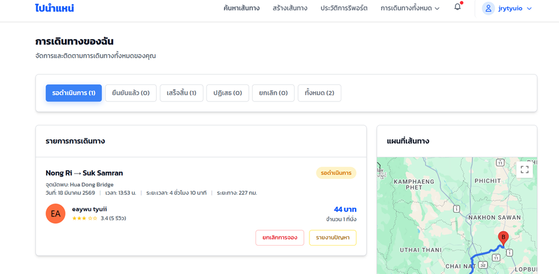 

### การรายงานปัญหา

สามารถรายงานปัญหาการเดินทางได้ โดยเมื่อกดปุ่ม **รายงานปัญหา** จะมีฟอร์มให้กรอกข้อมูลและหลักฐาน แบบฟอร์มรายงานประกอบด้วย:

- เลือกผู้ถูกรายงาน (คนเดียวหรือหลายคน)
- เลือกประเภทปัญหา
- กรอกรายละเอียดเพิ่มเติม
- แนบหลักฐาน ได้ทั้งรูปภาพและวิดีโอ ไม่เกินอย่างละ3 ไฟล์

> 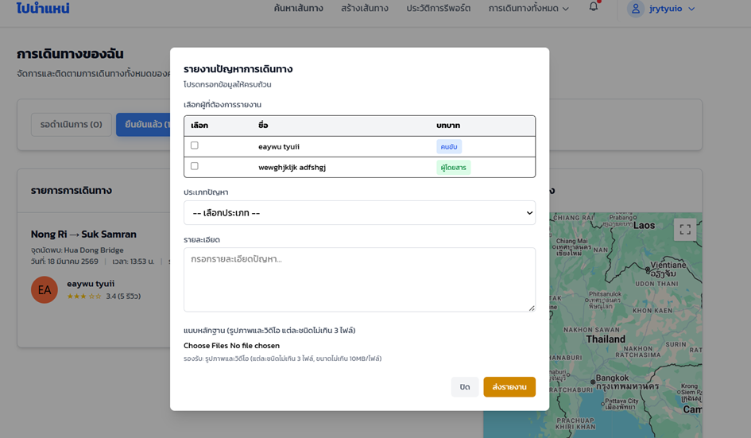 

> **หมายเหตุ:** เมื่อส่งรายงานแล้ว จะไม่สามารถรายงานซ้ำได้จนกว่าเคสจะสิ้นสุด

### ประวัติการรายงาน

หลังส่งรายงานสำเร็จ ระบบจะพาไปยังหน้าประวัติการรายงาน ผู้ใช้สามารถเพิ่มหลักฐานหรือคำอธิบายเพิ่มเติมได้ พร้อมตรวจสอบสถานะของเคส

> 

>  

### การจัดการรายงานฝั่งแอดมิน

ฝั่งแอดมินจะมีหน้า **Report Management** แสดงรายงานทั้งหมด พร้อมสถานะ ในหน้ารายละเอียดการรายงาน จะมีข้อมูลอย่างละเอียดเกี่ยวกับปัญหาที่เจอ รวมถึงรายชื่อคนที่ถูกรายงาน ซึ่งแอดมินจะประเมินปัญหาที่ได้รับเพื่อเลือกว่าจะดำเนินการอย่างไร:

- **ให้ใบเหลือง** (เตือน) — หากโดนใบเหลืองครบ 3 ครั้ง จะได้รับ **ใบแดง** (ถูกแบน)
- **รับรายงาน**
- **ปิดเคส**
- **ปฏิเสธรายงาน**

> 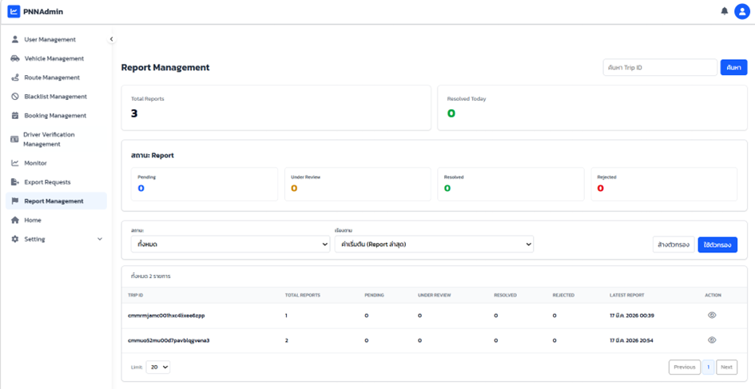

> 

> .png) 

> .png) 

>  

หลังดำเนินการแล้ว สถานะในประวัติการรายงานจะเปลี่ยนตามผลการพิจารณา

> 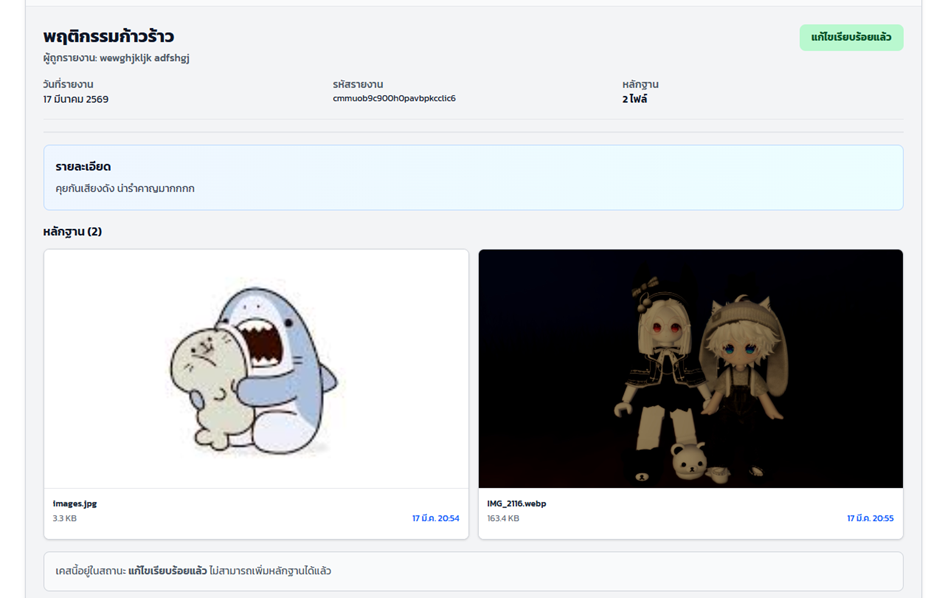

---

## ส่วนที่ 2 รายงานแจ้งอุบัติเหตุของผู้ขับขี่

### บทนำเกี่ยวกับระบบรายงานอุบัติเหตุ

ระบบรายงาน Incidents (เหตุการณ์/อุบัติเหตุทั่วไป) เป็นฟีเจอร์ที่ออกแบบมาเพื่อให้ผู้ขับขี่สามารถแจ้งเหตุการณ์ฉุกเฉินหรือปัญหาต่างๆ ที่เกิดขึ้นระหว่างการเดินทาง เช่น เหตุอุบัติเหตุ, ความเสียหายของรถ, เหตุฉุกเฉินด้านสุขภาพ, หรือเหตุการณ์อื่น ๆ ระบบนี้เป็นสิ่งสำคัญเพื่อให้ผู้ขับขี่ได้รับการช่วยเหลือและสนับสนุนอย่างรวดเร็ว

#### ประเภทอุบัติเหตุที่สามารถรายงาน

- **อุบัติเหตุทางถนน** — การชนกัน การดีดตัวออกนอกเส้นทาง
- **รถเสีย/ข้อข้อง** — เครื่องยนต์ดับ ยางแตก เบรกเสีย
- **เหตุฉุกเฉินทางการแพทยื** — ผู้โดยสารหมดลมหายใจ หัวใจวายกระทันหัน
- **ภัยธรรมชาติ** — พายุ ฝนตกหนัก น้ำท่วม
- **อาชญากรรม/ถูกคุกคาม** — การปล้น ความรุนแรง
- **อื่น ๆ** — เหตุการณ์อื่น ๆ ที่ไม่สามารถจำแนกได้

### ขั้นตอนการรายงานอุบัติเหตุ

#### ขั้นตอนที่ 1: เข้าหน้าคำขอจองเส้นทางของฉัน

ผู้ขับขี่สามารถเข้าไปที่หน้า **คำขอจองเส้นทางของฉัน** เพื่อเลือกทริปที่เกิดปัญหา

> 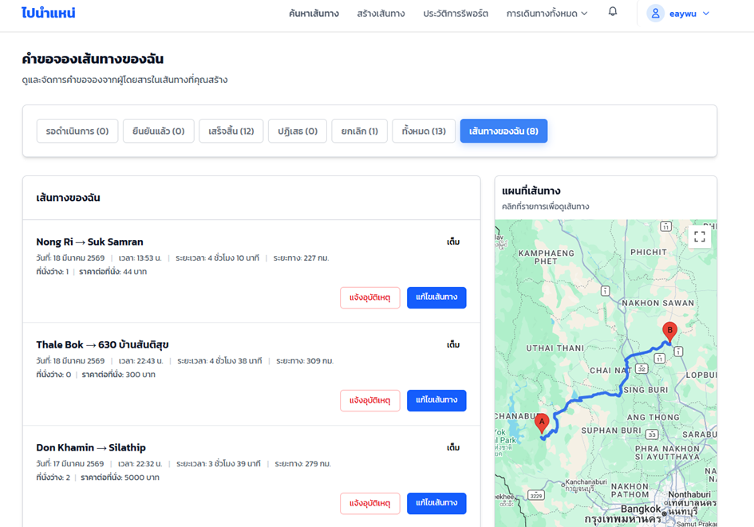

#### ขั้นตอนที่ 2: คลิกปุ่มแจ้งอุบัติเหตุ

จากรายการทริป จะมีปุ่ม **แจ้งอุบัติเหตุ** ให้ผู้ขับขี่คลิก

#### ขั้นตอนที่ 3: กรอกแบบฟอร์มอุบัติเหตุ

ระบบจะแสดงแบบฟอร์มรายงาน Incident ให้สำหรับกรอกข้อมูลดังนี้:

1. **ประเภทอุบัติเหตุ** — ต้องเลือกจากรายการประเภทข้างต้น
2. **รายละเอียด** — อธิบายเหตุการณ์อย่างละเอียด (ขั้นต่ำ 10 ตัวอักษร) เช่น เวลาที่เกิด สถานที่ สาเหตุ ผู้เกี่ยวข้อง
3. **ตำแหน่ง** — ระบบจะใช้ Google Maps เพื่อให้ผู้ขับขี่ทำเครื่องหมายตำแหน่งเฉพาะที่เกิดเหตุ โดยสามารถค้นหาที่อยู่หรือใช้ GPS ปัจจุบัน
4. **หลักฐาน** — สามารถอัปโหลดรูปภาพหรือวิดีโอเป็นหลักฐาน (ตามความเหมาะสม)

> 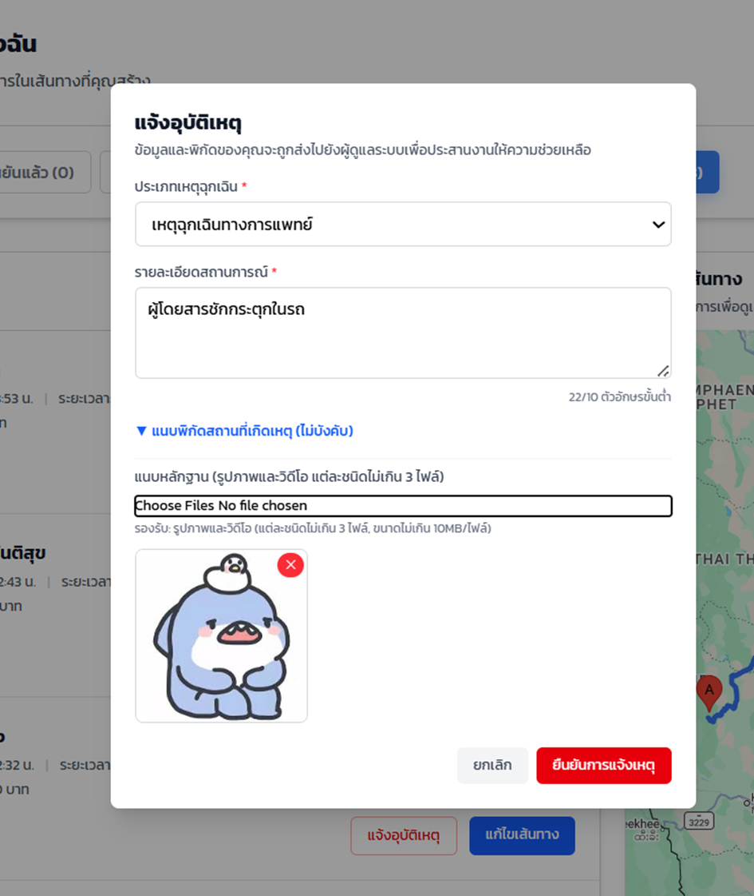

#### ขั้นตอนที่ 4 ส่งรายงาน

หลังจากกรอกข้อมูลครบถ้วน ผู้ขับขี่สามารถกดปุ่ม **ยืนยันการแจ้งเหตุ** เพื่อส่งรายงาน

### การจัดการรายงานอุบัติเหตุ ฝั่งแอดมิน

#### หน้า Incidents Management

แอดมินสามารถเข้าไปดูรายงานอุบัติเหตุ ทั้งหมดในระบบได้จากเมนู **Incidents Management** ซึ่งเป็นส่วนที่แยกจาก Report Management ที่สำหรับรายงานพฤติกรรมผู้ใช้ หน้านี้จะแสดง:
- รายการแจ้งอุบัติเหตุ ทั้งหมดที่รายงานมา
- ชื่อและรหัสของผู้ขับขี่ที่รายงาน
- ประเภทของอุบัติเหตุ
- สถานะปัจจุบัน
- วันที่รายงาน

> 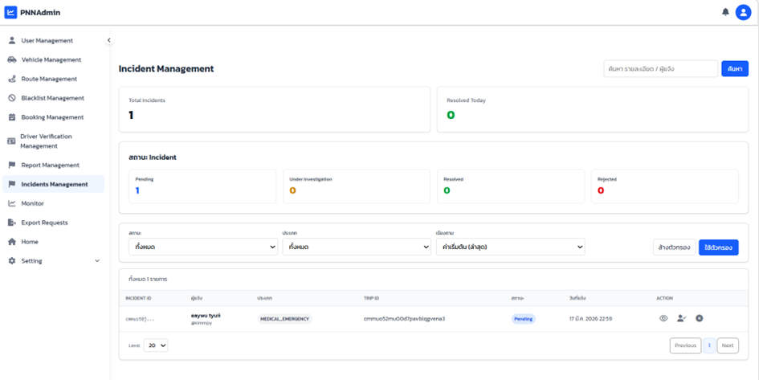

#### การจัดการสถานะรายงาน

แอดมินสามารถดำเนินการต่อรายงาน ได้หลายวิธี:

**1. รับเรื่อง** - การรับเรนื่องที่แจ้งเหตุเข้ามาตรวจสอบและดูแล

**2. ปิดเคส** — เมื่อจัดการเสร็จสิ้น แอดมินสามารถเปลี่ยนสถานะเป็น RESOLVED พร้อมใส่หมายเหตุ ตัวอย่างหมายเหตุ เช่น:
   - "ตรวจสอบและจัดการเรียบร้อยแล้ว"
   - "ติดต่อผู้ขับขี่เพื่อให้ความช่วยเหลือ"
   - "ส่งให้หน่วยงานที่เกี่ยวข้อง"

**3. ปฏิเสธการรายงาน** — หากเห็นว่าการรายงานไม่มีความจำเป็นหรือไม่ถูกต้อง อาจปฏิเสธ พร้อมใส่เหตุผล

> 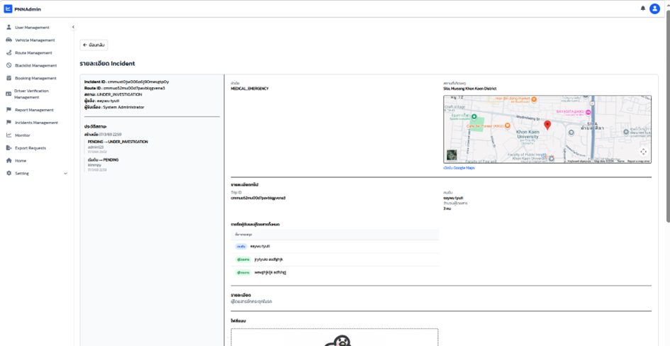
> 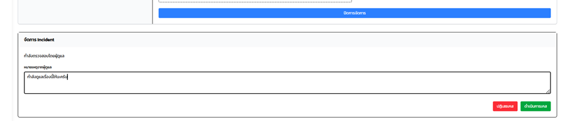

#### การติดตาม Incidents

แอดมินสามารถมองเห็นประวัติการจัดการรายงานอุบัติเหตุ ได้ เช่น:
- เปลี่ยนสถานะเป็นอย่างไร
- เวลาที่เปลี่ยน

### ข้อพึงระวังและคำแนะนำ

1. **รายงานโดยเร็ว** — ควรรายงานอุบัติเหตุ ทันทีที่เกิดขึ้น เพื่อให้ได้รับการช่วยเหลืออย่างรวดเร็ว
2. **รายละเอียดชัดเจน** — ให้ข้อมูลที่เป็นประโยชน์เพื่อหน่วยงานสามารถให้ความช่วยเหลือได้อย่างมีประสิทธิภาพ
3. **หลักฐานชัดเจน** — ถ้าสามารถ ให้อัปโหลดรูปภาพหรือวิดีโอที่ชัดเจน
4. **ตำแหน่งที่ถูกต้อง** — ให้แน่ใจว่าตำแหน่งที่ทำเครื่องหมายนั้นถูกต้อง เพื่อให้บริการช่วยเหลือหาตำแหน่งได้ง่าย

---

## ส่วนที่ 3 การให้คะแนนดาวและรีวิวผู้ขับขี่

### บทนำเกี่ยวกับระบบรีวิว

ระบบให้คะแนนดาวและรีวิวผู้ขับขี่เป็นฟีเจอร์ที่ออกแบบมาเพื่อให้ผู้โดยสารสามารถประเมินประสบการณ์การเดินทางและคุณภาพบริการของผู้ขับขี่ได้ ระบบนี้มีส่วนสำคัญในการสร้างความไว้วางใจและความน่าเชื่อถือในแพลตฟอร์ม

#### กฎเกณฑ์การรีวิว

- ผู้โดยสารเท่านั้นที่สามารถให้คะแนนและเขียนรีวิวได้
- สามารถให้คะแนนและรีวิวผู้ขับขี่ได้เฉพาะเมื่อการเดินทางเสร็จสิ้นแล้ว
- **ห้ามอัปโหลดรีวิวซ้ำสำหรับการเดินทางเดียวกัน** — ผู้โดยสารสามารถส่งรีวิวได้เพียงครั้งเดียวต่อการเดินทางแต่ละครั้ง
- คะแนนต้องอยู่ในช่วง **1 ถึง 5 ดาว**
- ค่าเฉลี่ยคะแนนจะถูกคำนวณให้ผู้ใช้ทั่วไปทราบประสบการณ์ของผู้ขับขี่

### ขั้นตอนการให้คะแนนและ เขียนรีวิว

#### ขั้นตอนที่ 1: เข้าหน้าการเดินทางของฉัน

หลังจากการเดินทางเสร็จสิ้น ผู้โดยสารสามารถเข้าหน้า **การเดินทางของฉัน** เพื่อดูการเดินทางที่เสร็จสิ้นแล้ว

> 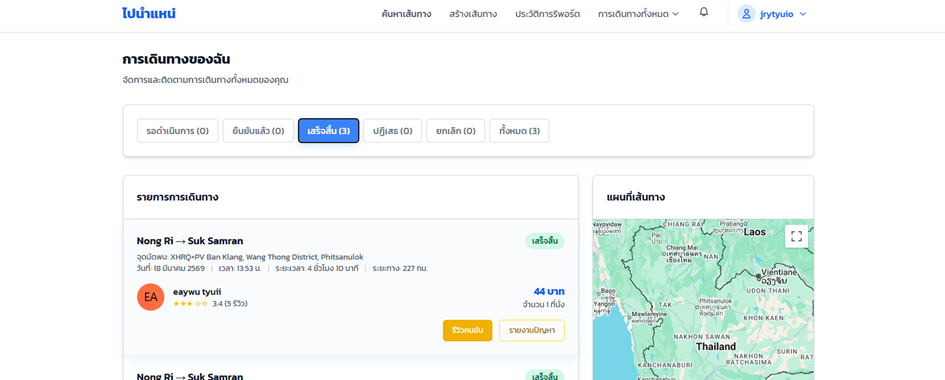 

#### ขั้นตอนที่ 2: คลิกปุ่มให้รีวิวคนขับ

สำหรับการเดินทางที่มีสถานะ **เสร็จสิ้น** จะมีปุ่ม **รีวิวคนขับ** ให้ผู้โดยสารคลิก

#### ขั้นตอนที่ 3: กรอกแบบฟอร์มรีวิว

เมื่อคลิกปุ่มให้คะแนน ระบบจะแสดงแบบฟอร์มรีวิวให้สำหรับกรอกข้อมูลดังนี้:

1. **คะแนนดาว (Rating)** — เลือกจำนวนดาวตั้งแต่ 1 ถึง 5
   - 5 ดาว = ดีมาก
   - 4 ดาว = ดี
   - 3 ดาว = ปานกลาง
   - 2 ดาว = แย่
   - 1 ดาว = แย่มาก

2. **ความเห็น/ข้ออความรีวิว (Comment)** — เขียนความเห็นหรือข้อมูลเพิ่มเติมเกี่ยวกับประสบการณ์การเดินทาง (ไม่บังคับ)

> 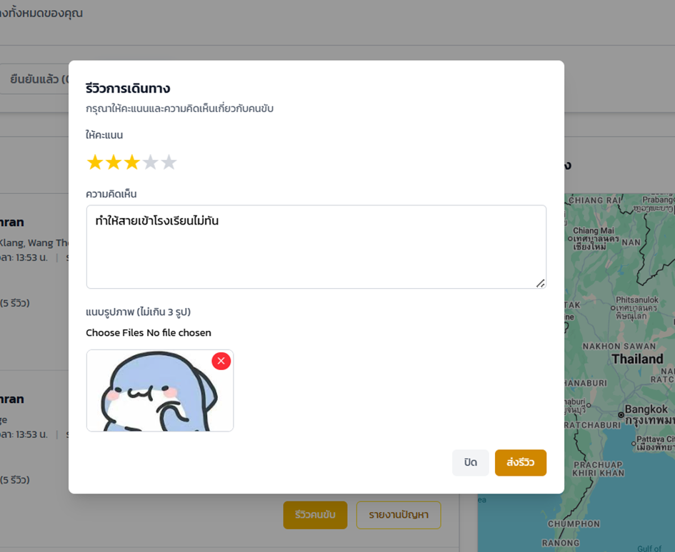 

#### ขั้นตอนที่ 4: ส่งรีวิว

หลังจากกรอกข้อมูลครบถ้วน ผู้โดยสารสามารถกดปุ่ม **ส่งรีวิว** เพื่อยืนยันการรีวิว

#### ขั้นตอนที่ 5: ยืนยันการส่งรีวิว

เมื่อส่งรีวิวสำเร็จ ระบบจะแสดงข้อความยืนยัน และสถานะในการเดินทางจะเปลี่ยนเป็น **รีวิวแล้ว** 

>  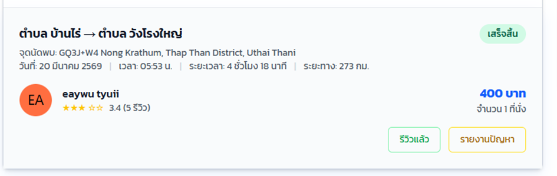 

#### การประมวลคะแนนรีวิว

ระบบจะคำนวณค่าเฉลี่ยคะแนนจากรีวิวทั้งหมดของผู้ขับขี่ สูตรการคำนวณ:

**ค่าเฉลี่ยคะแนน = (คะแนนทั้งหมด) ÷ (จำนวนรีวิว)**

#### การมองเห็นหน้าโปรไฟล์ผู้ขับขี่

เมื่อผู้โดยสารคลิกดูข้อมูลผู้ขับขี่ ระบบจะแสดง:

- **ค่าเฉลี่ยคะแนน** 
- **จำนวนรีวิว** ทั้งหมด
- **ตัวอย่างรีวิว** เรียงจากล่าสุด

> 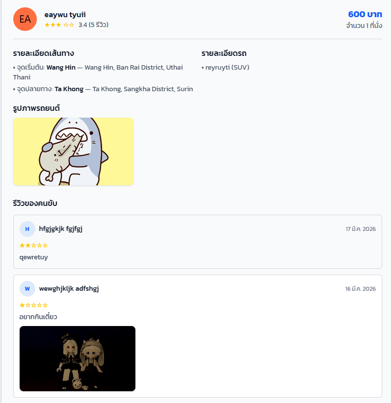 

### ข้อพึงระวังและคำแนะนำ

1. **เขียนรีวิวอย่างสุจริต** — ให้คะแนนตามประสบการณ์จริง ไม่ใช่ความรู้สึกส่วนตัว
2. **หลีกเลี่ยงเนื้อหาที่ไม่เหมาะสม** — ห้ามใช้ภาษาหมิ่นประมาท หรือเนื้อหาที่ละเมิดสิทธิ
3. **ตรวจสอบข้อมูลก่อนส่ง** — อ่านรีวิวอีกครั้งก่อนกดส่ง เพราะไม่สามารถแก้ไขหรือลบได้หลังจากส่งแล้ว
4. **รีวิวช่วยปรับปรุง** — คะแนนและข้อมูลของคุณช่วยให้ผู้ขับขี่อื่นและระบบพัฒนาได้ดีขึ้น

---
## ส่วนที่ 4 การขอข้อมูลประวัติการใช้งาน

### การเข้าถึงหน้าโปรไฟล์

หลังจากเข้าสู่ระบบ จะเข้าสู่หน้าหลัก และสามารถกดที่รูปโปรไฟล์เพื่อเข้าสู่หน้าโปรไฟล์ของตนเอง

> 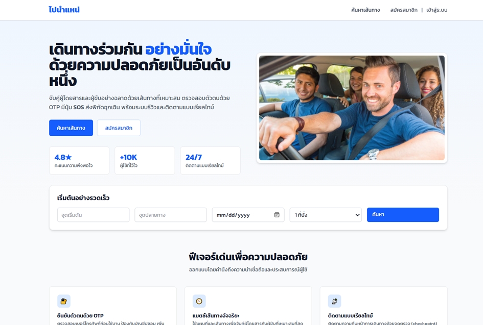

### การส่งคำขอข้อมูล

ในหน้าโปรไฟล์ ผู้ใช้สามารถกดขอข้อมูลประวัติการใช้งาน โดยมีขั้นตอนดังนี้:

1. เลือกประเภทไฟล์
2. กำหนดช่วงวันที่
3. ระบุเหตุผลในการขอข้อมูล
4. กดส่งคำขอ

> 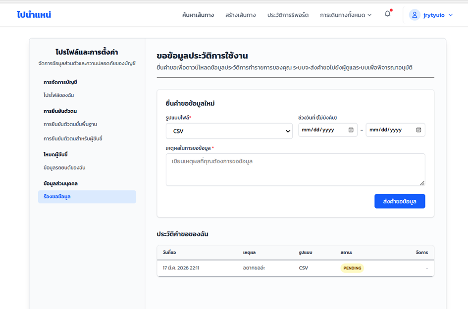 

เมื่อกดส่งคำขอ ระบบจะแสดงสถานะคำขอให้ผู้ใช้ติดตาม

### การจัดการคำขอฝั่งแอดมิน

เมื่อผู้ใช้ส่งคำขอประวัติมา ฝั่งแอดมินจะสามารถเลือกได้ว่าจะ **อนุมัติ** หรือ **ปฏิเสธ** ตามเหตุผลอันสมควรตามดุลพินิจ โดยหากอนุมัติ ก็จะมีปุ่มดาวน์โหลดให้สามารถโหลดไฟล์ออกไปได้

> 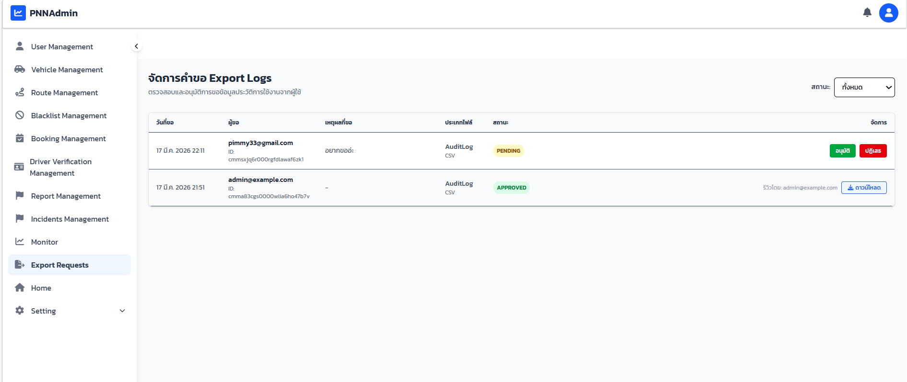 

---

## ส่วนที่ 5 การตรวจสอบ Log (Monitor Dashboard)

### หน้า Monitor Dashboard 

เมื่อเข้าระบบของแอดมิน จะมีแถบเมนู **Monitor Dashboard** กดแล้วจะพบกับหน้า Monitor Dashboard ที่มีไว้เพื่อตรวจสอบปัญหาและสิ่งผิดปกติต่างๆ ที่เกิดขึ้นในเว็บไซต์ โดยจะมีสรุปรวมดังนี้:

- **Total Requests** — จำนวนรีเควสทั้งหมด
- **Errors** — จำนวน Error ที่เกิดขึ้น
- **Avg Response Time** — ค่าเฉลี่ยในการตอบสนอง

### ประเภท Log

ในส่วนของตาราง สามารถกดเลือกได้ 3 แท็บเพื่อเปลี่ยนไปดูตารางข้อมูล ได้แก่:

1. **Audit Log** — บันทึกการกระทำของผู้ใช้ในระบบ เช่น LOGIN_SUCCESS, LOGOUT, UPDATE_USER_STATUS
2. **System Log** — บันทึก Request/Response ของ API เช่น Method, Path, Status, Duration
3. **Access Log** — บันทึกการเข้า-ออกของผู้ใช้ เช่น Login Time, Logout Time, IP Address

สามารถกรองข้อมูลเพื่อให้ตรวจสอบได้ง่ายขึ้น และ Export ไฟล์เพื่อนำไปใช้ในกระบวนการทางกฎหมาย

> 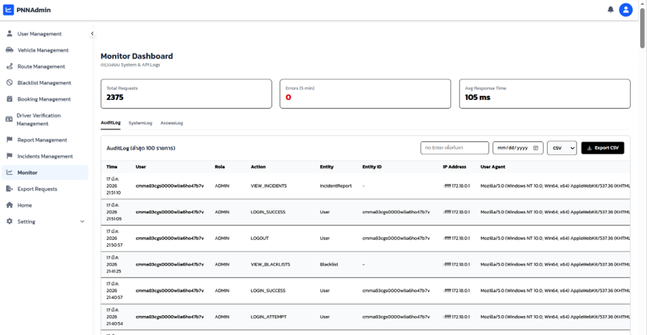 

> 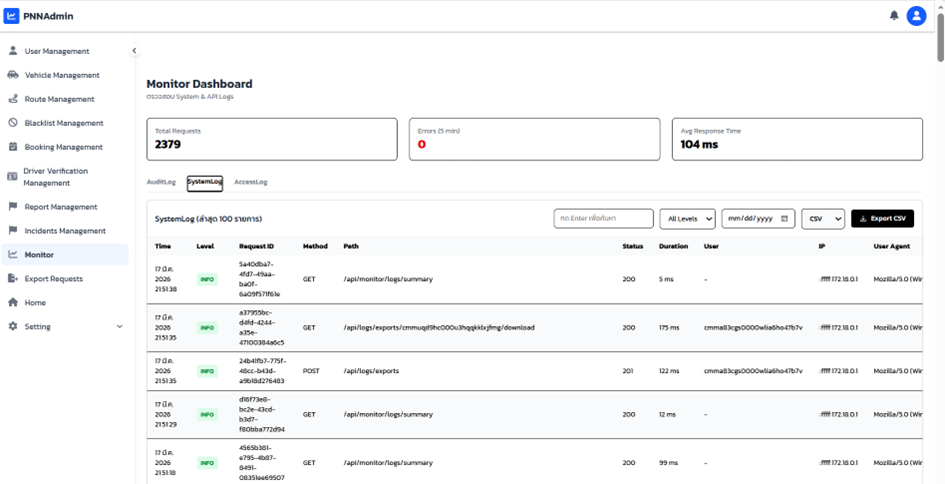 

> 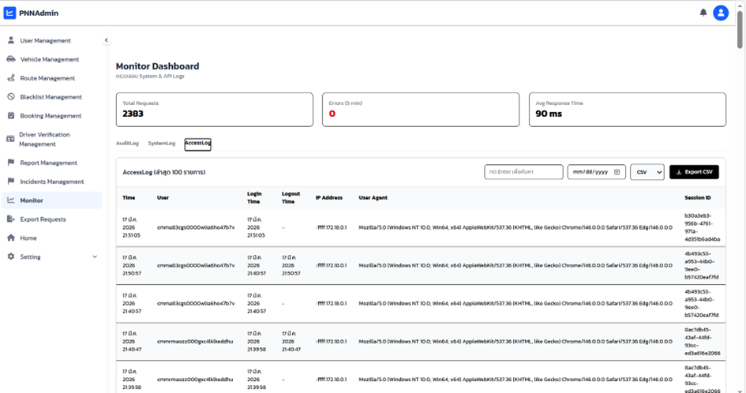 
